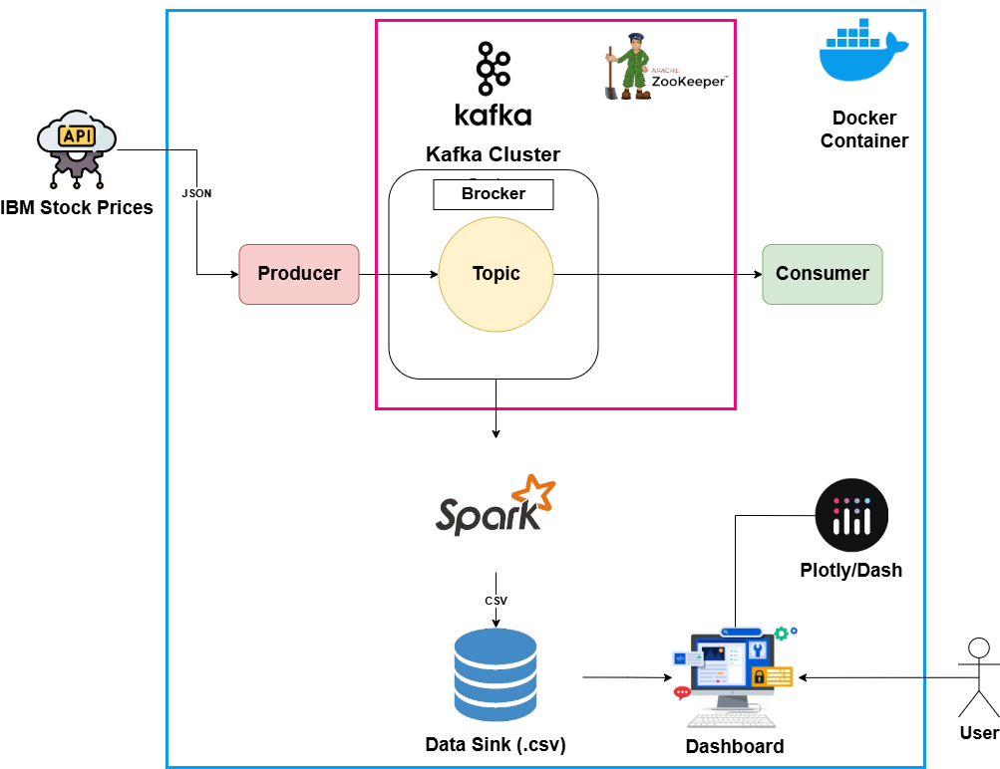
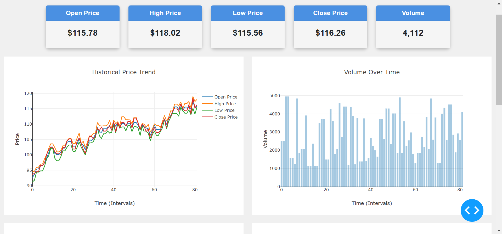
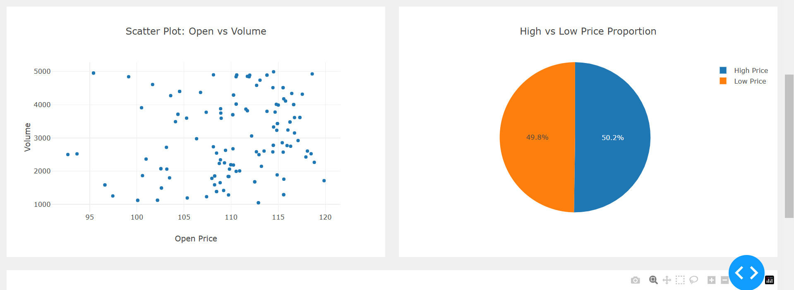
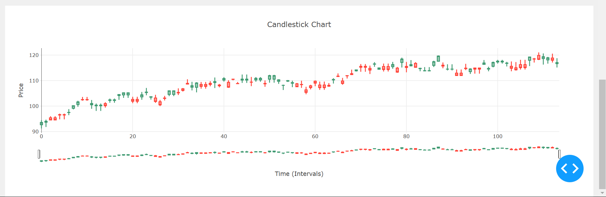

# RT-Dashboard  
A robust data pipeline and visualization system using a powerful tech stack: **Apache Kafka**, **Zookeeper**, **Apache Spark**, **Plotly/Dash**, and **Docker**.  

This project fetches real-time IBM stock prices (OHLCV - Open, High, Low, Close, Volume), processes the data, and visualizes it in an interactive dashboard.  

---

## 📸 **Project Overview**  

### **1. Architecture Diagram**  
  
*The high-level architecture of the project. Data flows from Kafka (for real-time streaming) to Spark (for processing) and finally to Plotly/Dash for visualization. Zookeeper ensures Kafka's coordination, and Docker containerizes the entire system.*  

---

### **2. Dashboard - Real-Time Stock Prices**  
  
*The main dashboard showing real-time IBM stock prices. The OHLCV data is updated dynamically as new data streams in.*  

---

### **3. Dashboard - OHCLV Analysis**  
  
*A view of historical stock price trends, allowing users to analyze patterns over time.*  

---

### **4. Dashboard - Simplified Candlestick**  
  
*Volume analysis chart, highlighting trading activity and its correlation with price movements.*  

---

## 🛠️ **Tech Stack**  
- **Apache Kafka**: Real-time data streaming.  
- **Zookeeper**: Coordination and management of Kafka brokers.  
- **Apache Spark**: Data processing and transformation.  
- **Plotly/Dash**: Informative and dynamic dashboard creation.  
- **Docker**: Containerization for easy deployment and scalability.  

---

## 🚀 **How to Run**  
1. Clone the repository:  
   ```bash  
   git clone https://github.com/ahmeddsaidi/RT-Dashboard.git

---

## 🚀 **Project Structure**  
RT-Dashboard/  
├── App/  
│   └── app.py  
├── Docker/  
│   ├── docker-compose.yml  
│   └── README.md  
├── Images/  
│   ├── architecture.png  
│   └── img1.png  
│   └── img2.png  
│   └── img3.png  
├── Kafka/  
│   ├── producer.py  
│   └── consumer.py  
├── Spark/  
│   └── spark_streaming.py  
└── README.md
